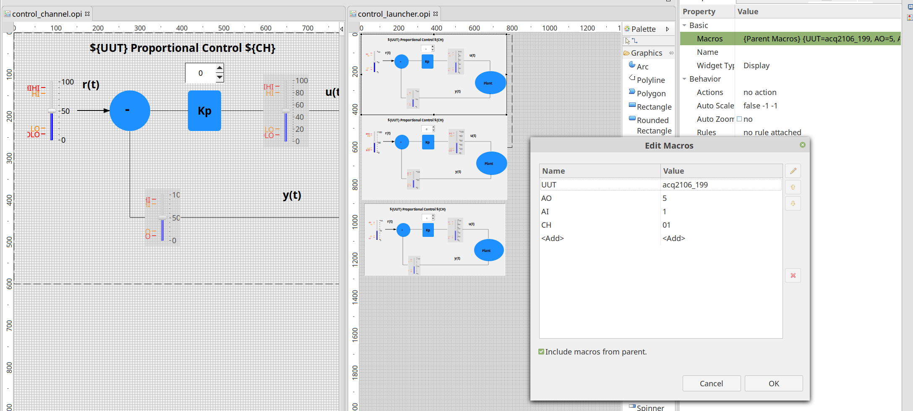
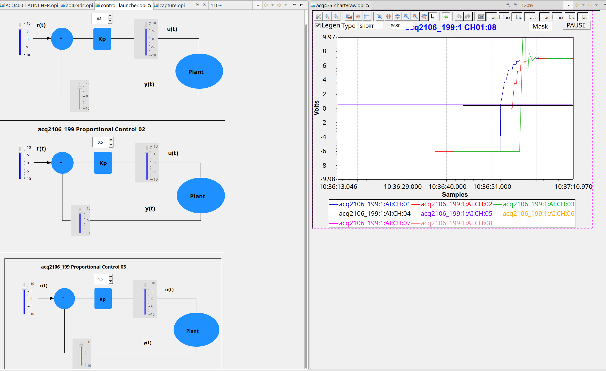

# Repeat TUT1 but with real data on live IOC

## REFS:
 - https://en.wikipedia.org/wiki/PID_controller
 - https://en.wikipedia.org/wiki/PID_controller#/media/File:PID_en.svg
### u1 = u0 + (r1 - y0)*Kp

```
git clone https://github.com/D-TACQ/EPICSTUT.git
git checkout -b TUT2 origin/TUT2
```
## Extend live IOC

 - sorry, there is some special stuff here:

### Copy extension to UUT:

```
scp control_tut.tar root@UUT:/mnt/local
scp sysconfig/epics.sh root@UUT:/mnt/local/sysconfig/epics.sh
```
What does this do?

 - /mnt/local/sysconfig/epics.sh:

  - First, unpack the patch package
```[ ! -e /usr/local/epics/db/control_tut.db ] && \
	tar xvf /mnt/local/control_tut.tar -C /usr/local/epics 
```
  - Second, when the IOC loads, it will run this script.
```export IOC_PREINIT=./scripts/load.control_tut
```
The script instantiates NCHAN control records.
end result, like this:
```
acq2106_199> grep control_tut /tmp/st.cmd 
dbLoadRecords("db/control_tut.db","UUT=acq2106_199,SITE=5,CH=01,idx=1")
dbLoadRecords("db/control_tut.db","UUT=acq2106_199,SITE=5,CH=02,idx=2")
dbLoadRecords("db/control_tut.db","UUT=acq2106_199,SITE=5,CH=03,idx=3")
dbLoadRecords("db/control_tut.db","UUT=acq2106_199,SITE=5,CH=04,idx=4")
dbLoadRecords("db/control_tut.db","UUT=acq2106_199,SITE=5,CH=05,idx=5")
dbLoadRecords("db/control_tut.db","UUT=acq2106_199,SITE=5,CH=06,idx=6")
dbLoadRecords("db/control_tut.db","UUT=acq2106_199,SITE=5,CH=07,idx=7")
dbLoadRecords("db/control_tut.db","UUT=acq2106_199,SITE=5,CH=08,idx=8")
dbLoadRecords("db/control_tut.db","UUT=acq2106_199,SITE=5,CH=09,idx=9")
dbLoadRecords("db/control_tut.db","UUT=acq2106_199,SITE=5,CH=10,idx=10")
dbLoadRecords("db/control_tut.db","UUT=acq2106_199,SITE=5,CH=11,idx=11")
dbLoadRecords("db/control_tut.db","UUT=acq2106_199,SITE=5,CH=12,idx=12")
dbLoadRecords("db/control_tut.db","UUT=acq2106_199,SITE=5,CH=13,idx=13")
dbLoadRecords("db/control_tut.db","UUT=acq2106_199,SITE=5,CH=14,idx=14")
dbLoadRecords("db/control_tut.db","UUT=acq2106_199,SITE=5,CH=15,idx=15")
dbLoadRecords("db/control_tut.db","UUT=acq2106_199,SITE=5,CH=16,idx=16")
```

#### Key Points
 - .db file is configured by MACRO PARAMETERS eg ${UUT}, ${CH}
 - .db file creates a set of records each time it's loaded.
 - BUT records with expanded (literal) parameters => we only get ONE record
 - eg GAIN has parameter ${CH} in the name, we get NCHAN*GAIN records, but
```
acq2106_199> grep :5:GAIN /tmp/records.dbl
acq2106_199:5:GAIN:01
acq2106_199:5:GAIN:02
acq2106_199:5:GAIN:03
acq2106_199:5:GAIN:04
acq2106_199:5:GAIN:05
acq2106_199:5:GAIN:06
acq2106_199:5:GAIN:07
acq2106_199:5:GAIN:08
acq2106_199:5:GAIN:09
acq2106_199:5:GAIN:10
acq2106_199:5:GAIN:11
acq2106_199:5:GAIN:12
acq2106_199:5:GAIN:13
acq2106_199:5:GAIN:14
acq2106_199:5:GAIN:15
acq2106_199:5:GAIN:16
```
 - CONTROL has literal :01 in the name, we get just the one record.
.. that's for this demo ONLY, more normally, we'd include ${CH} in the name for CONTROL and get NCHAN CONTROL records also..
```
acq2106_199> grep :5:CONTROL /tmp/records.dbl
acq2106_199:5:CONTROL:01
```

 - This is the core control record:
```
record(calcout, "${UUT}:${SITE}:CONTROL:01")
{
        field(DESC, "proportional controller")
        field(INPA, "${UUT}:${SITE}:SET:01")
        field(INPB, "${UUT}:1:AI:CH:01")
        field(INPG, "${UUT}:${SITE}:GAIN:01")
        field(CALC, "VAL + (A-B)*G")
        field(OUT,  "${UUT}:${SITE}:AO:SLOW_SET:CH:01 PP")
}

```

 - Control With pyepics:
  - https://github.com/D-TACQ/acq400_hapi/blob/master/test_apps/pyepics_control2.py
  - creates PyEpics objects to map all the PVS
  - nb python "{}".format(uut) is the python analog to epics "${UUT}"
```
    pv_Kp = epics.PV("{}:{}:GAIN:{:02d}".format(uut, args.dac, ch))
    pv_r1 = epics.PV("{}:{}:SET:{:02d}".format(uut, args.dac, ch))
    pv_y0 = epics.PV("{}:{}:AI:CH:{:02d}".format(uut, args.adc, ch))
    pv_u1 = epics.PV("{}:{}:AO:SLOW_SET:CH:{:02d}".format(uut, args.dac, ch))
```
  - this is the core of the control:
```
    while True:
        Kp = pv_Kp.get() 
  	r1 = pv_r1.get()
        y0 = pv_y0.get()
        u0 = pv_u1.get()

        u1 = u0 + (r1-y0)*Kp
  
        pv_u1.put(u1)

        time.sleep(0.8) # Wait for the DAC value to change

```

  - start two single-channel control processes on host computer
```
[peter@andros test_apps]$ ./pyepics_control2.py --ch=2 acq2106_199 &
[1] 24422
[peter@andros test_apps]$ Starting control loop 2

[peter@andros test_apps]$ ./pyepics_control2.py --ch=3 acq2106_199 &
[2] 24550
```


## GUI Client

1. Create cs-studio workspace
1. Import.. FileSystem .. Navigate to TUT/OPI, select OPI, td2.opi
Into Folder CSS
1. From Navigator, select CSS/control_launcher.opi, open in editor, set macros and save:
 - UUT
 - SITE
#### cs-studio ALSO makes big use of macros, similar to the EPICS db file ..

1. Press the > run button
 - Show controllers running with different gains, different controller locatons.


## What did we show:

 1. Extension of existing live IOC, added new records (SET, GAIN), hooked to existing records (AI:CH, AO:SLOWSET)
 1. Implemented simple controllers both inside the IOC (CALC record) and externally (PyEpics program)
 1. Showed use of macros to generalise records and OPI's.


