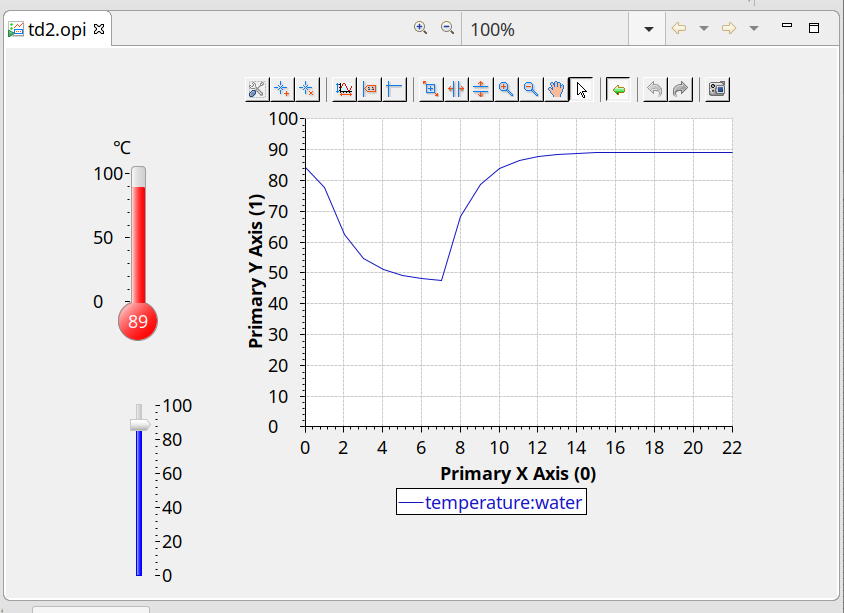

# Create and view some EPICS records.

Taken from 
https://docs.epics-controls.org/projects/how-tos/en/latest/getting-started/installation.html 

## If you built a local IOC, use it
* softIoc -d test.db
* softIoc -d test2.db
* softIoc -d test3.db


## Possible to use an ACQ400 IOC like this:

### log in and shut down the existing IOC (console, <CTRL>-T, <CTRL>-X
ssh root@UUT
eg UUT=acq1001_301
```
acq1001_301> acq4xx-epics-console 
^T
@@@ Toggled auto restart to OFF
epics> ^X
```
### copy sample db
```
scp -r db root@UUT:/usr/local/epics
```
### run the IOC (nb needs cmd file, test3.db only)
```
ssh root@UUT
cd /usr/local/epics
acq400ioc db/st3.cmd
```

## GUI Client

1. Create cs-studio workspace
1. Import.. FileSystem .. Navigate to TUT/OPI, select OPI, td2.opi
Into Folder CSS
1. From Navigator, select CSS/td2.opi, double click, run




